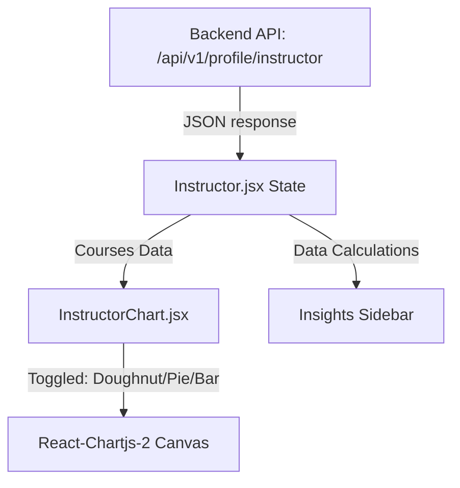

# StudyNet (OpenHand Practice Platform) 🚀

StudyNet is a premium, feature-rich, full-stack EdTech platform that provides secure practice spaces and courses for client coaching, video lectures, and personal reflections. 

It provides an interactive learning portal for **Students** to purchase, stream, and track progress on courses, and a comprehensive coaching command center for **Instructors** to build content, analyze client numbers, and monitor revenue payouts.

---

## 🌟 Key Features

### 👤 Authentication & Profiles
- **Secure Onboarding:** OTP verification via Nodemailer and `otp-generator`.
- **Role-based routing:** Custom portals for Students, Instructors, and Admins.
- **Password Recovery:** Direct email link token mechanism to reset forgotten credentials.
- **Interactive Profiles:** Change avatar display pictures, update dates, and edit professional bio cards.

### 🎓 Instructor Dashboard (Redesigned)
- **Elite Welcome Hero:** Elegant gradient-themed header with real-time greetings, current calendars, and CTA actions.
- **Glassmorphic Analytics cards:** Clear statistics for total active learning portals, client counts, and revenue with monthly trend simulations.
- **Interactive Multi-Format Charts:** Switching seamlessly between **Doughnut**, **Pie**, and **Bar** representations for enrollment and income distributions.
- **Quick Analytics Insights:** Automated telemetry indicating average price lists, status division (Published vs. Drafts), and your top-performing course.
- **Sleek Course Management:** Thumbnail scaling hover states, price tag overlays, and inline edit/preview controls.

### 📖 Course & Space Builder
- **Multi-step Creation:** Drag-and-drop course details, sections, and video subsections.
- **Media Hosting:** Fast video uploading and processing hosted securely via Cloudinary.
- **Category cataloging:** Explore active catalogs and dynamic course sliders.

### 💳 Purchases & Student Dashboard
- **Cart Management:** Keep track of checkout items.
- **Secure Payments:** Full sandbox payment flow integrated with **Razorpay**.
- **Progress Telemetry:** Active progress bars checking off completed lecture videos.
- **Certificate Portal:** Automatic certificate generation on course completion.

---

## 🛠️ Technology Stack

### Frontend
- **Framework:** React.js (v18)
- **State Management:** React Redux & Redux Toolkit
- **Styling:** TailwindCSS & Custom CSS
- **Visualization:** Chart.js & React-Chartjs-2
- **Routing:** React Router DOM (v6)

### Backend
- **Framework:** Node.js & Express.js
- **Database:** MongoDB (Mongoose ODM)
- **Authentication:** JSON Web Tokens (JWT) & Bcrypt
- **Email Delivery:** SMTP Nodemailer
- **Media Cloud:** Cloudinary Node SDK
- **Payment gateway:** Razorpay Node SDK

---

## 📁 Repository Structure

```
StudyNet/
├── backend/
│   ├── config/             # DB & Cloudinary connection scripts
│   ├── controllers/        # Route logic (Auth, Course, Payment, Profile)
│   ├── mail/               # HTML email templates (OTP, Payment confirmation)
│   ├── middleware/         # Auth verify validation token logic
│   ├── models/             # Mongoose schemas (User, Course, OTP, Section...)
│   ├── routes/             # Express API endpoints
│   ├── utils/              # Helper functions (Image uploader, Duration parser)
│   ├── index.js            # Node Entry Point
│   └── .env                # Server configuration (private)
│
└── frontend/
    ├── public/             # Static HTML assets
    ├── src/
    │   ├── assets/         # App icons & logo elements
    │   ├── components/     # UI components (Common & Core)
    │   │   └── core/
    │   │       └── Dashboard/ # Instructor, Sidebar, Student, Settings
    │   ├── data/           # Config links & mock metrics
    │   ├── pages/          # Primary Pages (Home, Course, Login, Dashboard...)
    │   ├── services/       # Axios API client integrations
    │   ├── slices/         # Redux state slices
    │   ├── App.jsx         # Client Routing entry
    │   └── index.js        # React bootstrap
    └── package.json        # Frontend Dependencies
```

---

## ⚙️ Setup and Installation

### 1. Prerequisites
- **Node.js** installed (v16+ recommended).
- **MongoDB** running locally (`mongodb://127.0.0.1:27017/StudyDB`) or a MongoDB Atlas connection string.
- A **Cloudinary** account credentials.
- A **Gmail App Password** for nodemailer transport.
- A **Razorpay Test Account** API credentials.

---

### 2. Backend Setup
1. Navigate into the backend folder:
   ```bash
   cd backend
   ```
2. Install npm dependencies:
   ```bash
   npm install
   ```
3. Configure the `.env` file in the `backend/` directory:
   ```env
   PORT=4000
   MONGODB_URL=YOUR_MONGO_DB_URL
   JWT_SECRET=YOUR_SECURE_JWT_SECRET
   
   # Cloudinary config
   CLOUD_NAME=YOUR_CLOUDINARY_NAME
   API_KEY=YOUR_CLOUDINARY_KEY
   API_SECRET=YOUR_CLOUDINARY_SECRET
   FOLDER_NAME=YOUR_CLOUDINARY_FOLDER
   
   # Email transport config
   MAIL_HOST=smtp.gmail.com
   MAIL_PORT=587
   MAIL_USER=YOUR_GMAIL_ADDRESS
   MAIL_PASS=YOUR_GMAIL_APP_PASSWORD
   
   # Razorpay credentials
   RAZORPAY_KEY=YOUR_RAZORPAY_TEST_KEY
   RAZORPAY_SECRET=YOUR_RAZORPAY_TEST_SECRET
   ```
4. Start the server in development mode (using nodemon):
   ```bash
   npm run dev
   ```

---

### 3. Frontend Setup
1. Navigate into the frontend folder:
   ```bash
   cd ../frontend
   ```
2. Install npm dependencies:
   ```bash
   npm install
   ```
3. Start the Vite/React development server:
   ```bash
   npm run start
   ```
4. The client application will launch locally at: `http://localhost:3000`.

---

## 📊 Instructor Dashboard Architecture
The new analytics visualizer parses student numbers and monetary metrics:

- **Live Calculations:** Includes calculations for `averagePrice`, `topCourse` tracking, and `draftCount` / `publishedCount` splits.
- **Theme Variables:** Styled strictly using Tailwind configurations matching `navy`, `royal-blue`, `violet`, `sky-blue`, and `paper` tokens.
